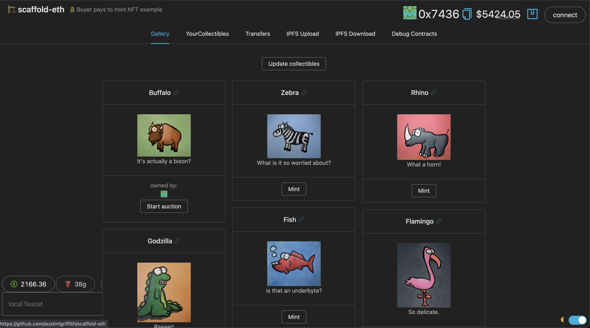
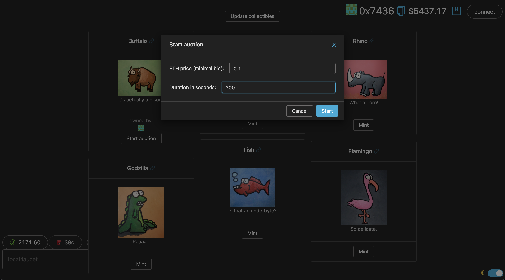
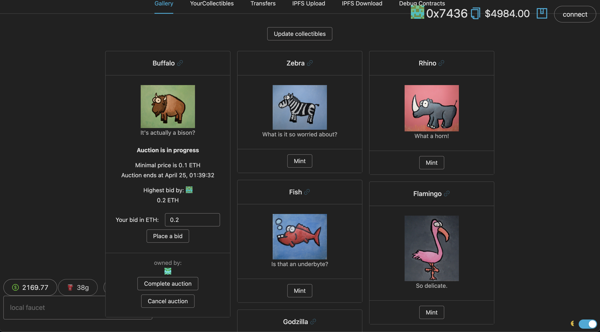
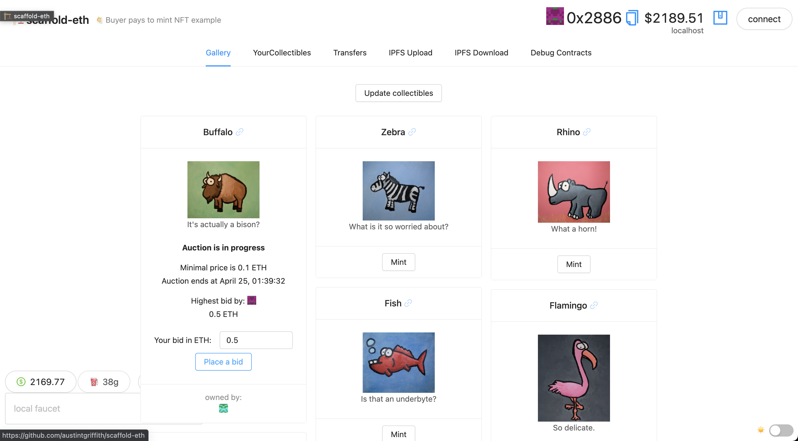
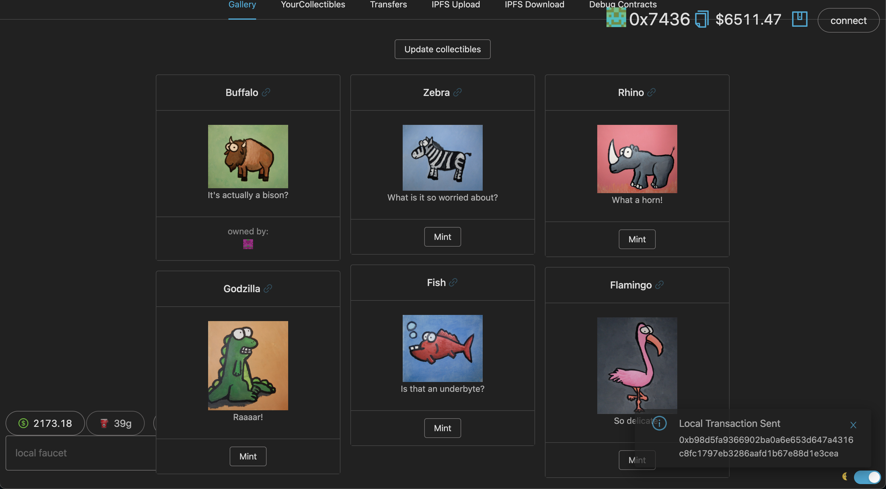

# 🏦🏗 scaffold-eth - Signature based NFT Auction

> Discover how you can build your own Signature based NFT auction with off-chain bidding where the highest bid gets an NFT

<details open="open">
  <summary>Table of Contents</summary>
  <ol>
    <li>
      <a href="#about-the-project">About The Project</a>
    </li>
    <li>
      <a href="#speed-run">Speed Run</a>
    </li>
    <li>
      <a href="#getting-started">Getting Started</a>
      <ul>
        <li><a href="#prerequisites">Prerequisites</a></li>
        <li><a href="#installation">Installation</a></li>
      </ul>
    </li>
    <li><a href="#smart-contracts">Exploring smart contracts</a></li>
    <li><a href="#practice">Practice</a></li>
    <li><a href="#additional-resources">Additional resources</a></li>
    <li><a href="#contact">Contact</a></li>
  </ol>
</details>

## About The Project
We will show you how a simple Signature based NFT auction can be built and also will demonstrate how you can spin it up locally as a playground.
## Speed Run
[](https://youtu.be/ws1bZ5VTolw)
## Getting Started

### Prerequisites

You have to know what is an ERC721 standard and what is NFT. Please refer to [this](http://erc721.org/) and [this](https://docs.openzeppelin.com/contracts/4.x/erc721) for more information if you are not familiar with these terms.

### Installation

Let's start our environment for tinkering and exploring how NFT auction would work.

1. Clone the repo first
```sh
git clone -b signature-nft-auction https://github.com/austintgriffith/scaffold-eth.git nft-auction
cd nft-auction
```


2. Install dependencies
```bash
yarn install
```
3. Start local chain
```bash
yarn chain
```

4. Start your React frontend
```bash
yarn start
```

5. Deploy your smart contracts to a local blockchain
```bash
yarn deploy
```

6. The ui currently depends on a json file so to generate that run
```bash
yarn upload
```

## Smart contracts

Let's navigate to `packages/hardhat/contracts` folder and check out what contracts we have there.

We are mostly interested in `Auction.sol` smart contract which contains all the logic for NFT auction.

### Auction.sol

First of all, note how we are initializing our smart contract using this line.

```solidity
contract Auction is IERC721Receiver
```

We inherit from [IERC721Receiver](https://docs.openzeppelin.com/contracts/4.x/api/token/erc721#IERC721Receiver) which is an interface created by OpenZeppelin. Inheriting from this contract will allow us to receive transfer of NFT from another account to our contract.

For signature verification we use ```Signature Checker``` contract based on [EIP 1271](https://github.com/ethereum/EIPs/blob/master/EIPS/eip-1271.md), do check that out for more details.

Inheriting from this contract also requires us to paste the implementation of `onERC721Received` which you can find at the bottom of the contract.

The logic for creating an auction is in `createTokenAuction` function. It takes an address of NFT contract which in our case is an address of `YourCollectible.sol` deployed to our local chain, unique token ID which is going to be sold, minimum bid and duration in seconds.

```solidity
ERC721(_nft).safeTransferFrom(owner, address(this), _tokenId);
tokenToAuction[_nft][_tokenId] = _auction;
```

As you can see above, creating an auction means temporarily transfer an NFT to the Auction contract and also save information about auction to our Solidity mapping.

The Bid placing takes places off-chain so first bidders need to stake eth and then they place bids off-chain which involves the bidders to sign a transaction and the signed transactions get's stored in the [server](https://github.com/austintgriffith/scaffold-eth/blob/signature-nft-auction/packages/backend/index.js) and at any point in time they can withdraw their stake.

`executeSale` is a function used to complete the auction and identify the winner. It simply checks the last element of all bids placed and transfers NFT to the winner. If no bids were made, NFT is returned back to the initial owner.

`cancelAuction` allows to prematurely cancel the auction and lets the initial owner to get back his NFT.


## Practice

Firstly, let's get us some funds using local faucet and mint any NFT, so we become its owner. 



You can now note that we have an option to Start auction because we are an owner of this newly minted NFT. Let's try to start an auction!



The minimal bid that users will be able to place is 0.1 ETH, and the total duration for our auction will be 5 minutes.


Auction is now in progress, and we can complete it or cancel it. No bids were made yet so there is no information about them yet. Inorder to make a bid we need to stake some eth and then make a bid which will just require our signature since that is off-chain.

After you submit your bid, the information about auction will be updated if your bid is the highest at this point of time.



We placed a bid of 0.2 ETH and now we are the highest bidder. Yay!

Now let's try to open an incognito window and place a higher bid by a different user.



We placed 0.5 ETH big as a different user and now it's the highest bid. Now let's get back to our first account to complete an auction.



As you see, after we finished the auction, we are no longer an owner of the NFT. The account which placed 0.5 ETH is now a new owner. This is why we do not have an option to start an auction now.

## Additional resources

* [Dutch auction](https://en.wikipedia.org/wiki/Dutch_auction) - The idea behind auctions used in this contract

## Contact

Join the [telegram support chat 💬](https://t.me/joinchat/KByvmRe5wkR-8F_zz6AjpA) to ask questions and find others building with 🏗 scaffold-eth!
